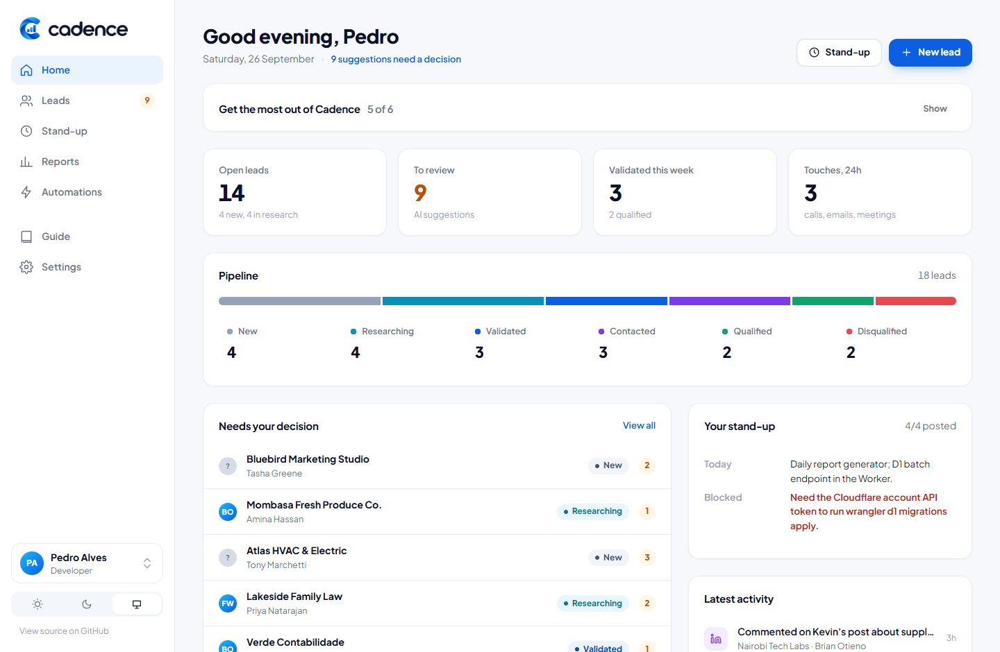
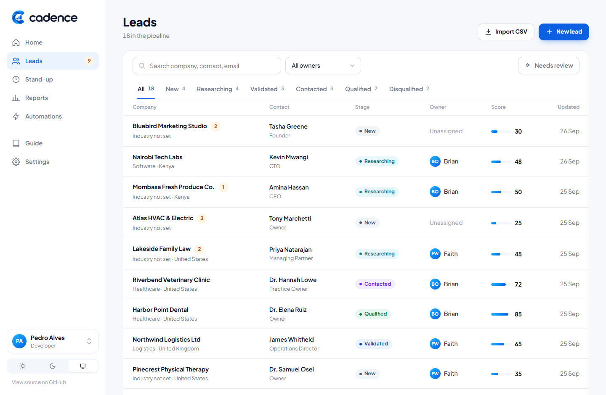
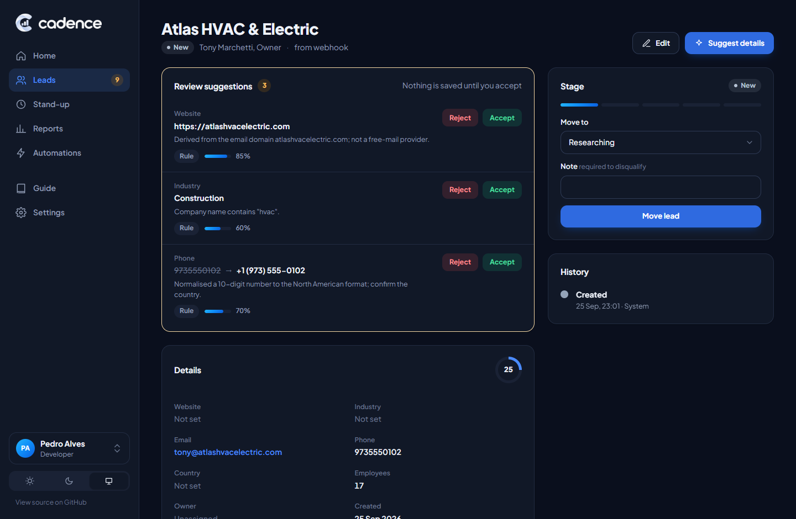
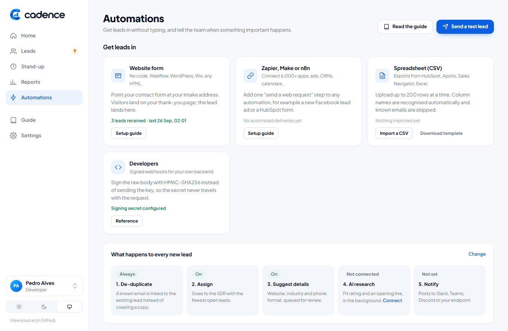
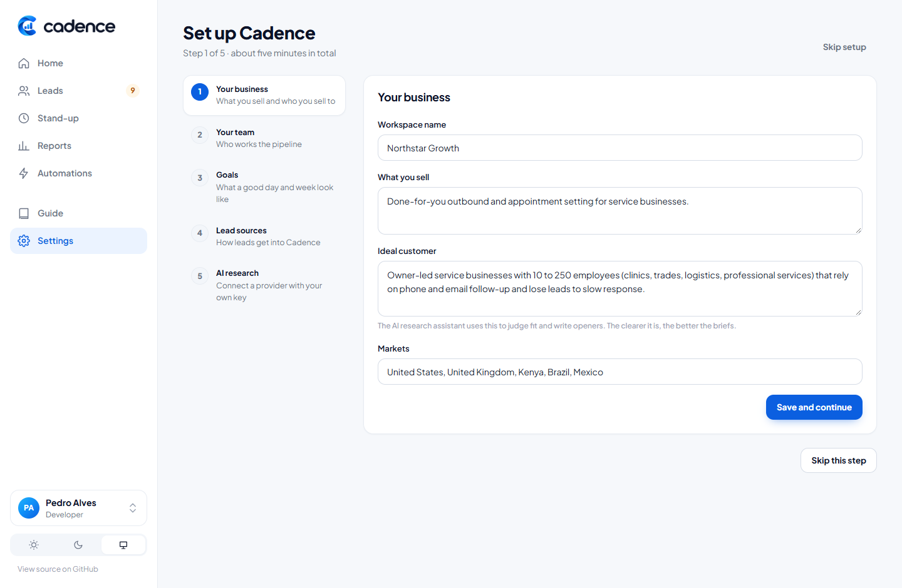
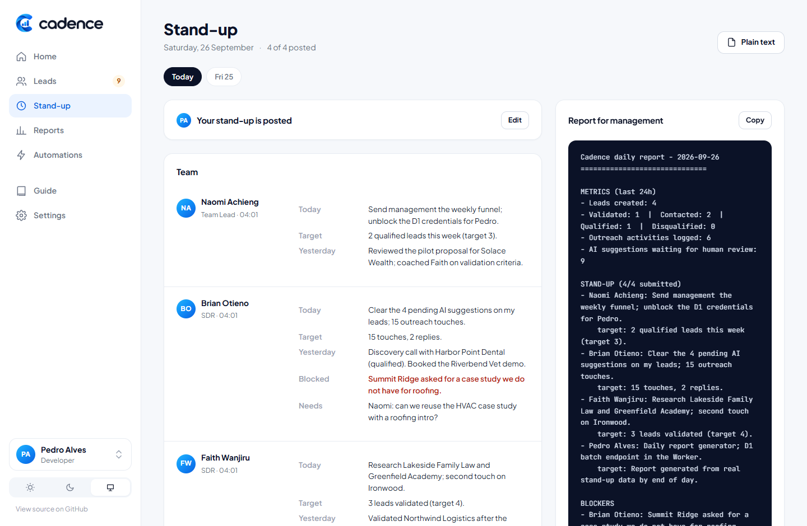
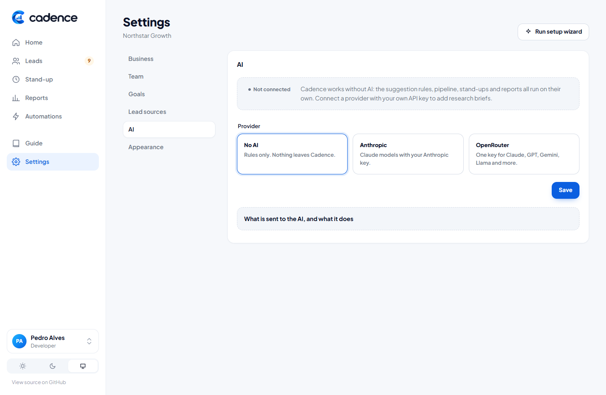

<p align="center"></p>

# Cadence

**An SDR workbench: lead pipeline, AI-assisted research with human validation, daily stand-ups and the management report that comes out of them.**

**Live demo:** https://cadence-jo48.onrender.com (free instance: the first visit after a quiet period takes about a minute to wake up). Data lives in Cloudflare D1 behind https://cadence-d1.pdmoura.workers.dev.

ASP.NET Core MVC · C# 13 / .NET 10 · SQLite locally, Cloudflare D1 in production · Cloudflare Workers · Docker on Render (or Cloudflare Containers) · xUnit · GitHub Actions



## Who it is for

Cadence is the daily workbench for a sales-development (SDR) team: the people who find companies worth talking to, check that the contact is real, reach out, and hand qualified conversations to sales. A typical day:

1. **Stand-up.** Everyone answers five questions (yesterday, today, the number they are chasing, blockers, help needed). The team lead gets a management report generated from the answers and the day's pipeline numbers, and can send it to Slack with one click.
2. **Review suggestions.** New leads arrive from website forms, Zapier/Make/n8n or a CSV. Rules propose missing details; an AI model, if connected, writes a research brief with a fit rating and an opening line. A person accepts or rejects each suggestion.
3. **Research, validate, reach out.** Leads move `New → Researching → Validated → Contacted → Qualified` (or `Disqualified` with a reason). Every move is an audit event and every touch is logged.
4. **Measure.** Goals for daily touches and weekly validated/qualified leads show as progress bars; reports are computed from the audit trail.

A first-run **setup wizard** (business and ideal customer, team, goals, lead sources, AI) and an in-app **Guide** make the workflow explicit. Light and dark themes follow the system or a per-device choice.

| Leads | Lead detail with suggestions (dark) |
| --- | --- |
|  |  |

| Automations | Setup wizard |
| --- | --- |
|  |  |

| Stand-ups and management report | AI settings |
| --- | --- |
|  |  |

The UI is one hand-written stylesheet and a small script (no build step), with accessible custom dropdowns, and it works on phones: [dashboard](docs/screenshots/mobile-dashboard.png), [lead](docs/screenshots/mobile-lead.png), [dark dashboard](docs/screenshots/dashboard-dark.png).

## Getting leads in

Every source goes through one intake service: de-duplicate by email, assign to the SDR with the fewest open leads (optional), run the suggestion rules, queue AI research in the background, notify the team channel.

| Source | For whom | How |
| --- | --- | --- |
| Website form | No-code | Point any HTML form at `/intake/{key}`. Honeypot field and thank-you redirect built in. |
| Zapier, Make, n8n | No-code | One web-request step to `/webhooks/leads` with the `X-Cadence-Key` header. |
| CSV import | Anyone | Upload exports from HubSpot, Apollo, Sales Navigator or Excel; headers are matched by name. |
| Signed webhook | Developers | `X-Cadence-Signature: sha256=HMAC(secret, raw body)`, constant-time verified. |
| Notifications | Everyone | Slack, Teams or Discord incoming webhooks get chat messages; other HTTPS endpoints get signed JSON. |

Setup guides with copy-paste snippets live on the Automations page and in [docs/AUTOMATIONS.md](docs/AUTOMATIONS.md).

## AI research (optional, bring your own key)

Cadence works fully without AI. To add research briefs, open **Settings, AI**, choose a provider and paste your own API key:

- **Anthropic**: Claude models (Opus 5 by default, Sonnet 5 or Haiku 4.5 selectable) through the official Anthropic .NET SDK, with structured outputs. Opus 5 requests include a server-side refusal fallback.
- **OpenRouter**: one key for many model families (Claude, GPT, Gemini, Llama and others) through its chat-completions API with a JSON schema.

Keys are encrypted with AES-GCM before they reach the database, shown only by their last four characters, and never read from environment variables, so a server's own credentials are never used by accident. The prompt includes the lead's details and the workspace's product, ideal customer and markets; the answer is only ever a suggestion that a person accepts or rejects.

## Architecture

```
                 ┌──────────────────────────── Cloudflare ────────────────────────────┐
  browser ──────▶│  Worker (TypeScript)                                               │
  webhooks ─────▶│   ├─ /internal/d1/*  ──▶  D1 binding (SQLite-compatible)           │
                 │   └─ everything else ──▶  Container: ASP.NET Core MVC (this repo)  │
                 │                              └─ ISqlExecutor ──HTTP──▶ Worker /internal/d1/* │
                 └────────────────────────────────────────────────────────────────────┘

  locally:  ASP.NET Core MVC ──▶ ISqlExecutor ──▶ SQLite file (same SQL, same migrations)
```

- **One SQL dialect, two backends.** Repositories depend on `ISqlExecutor` and write plain SQL with positional `?` parameters. `SqliteSqlExecutor` runs it against a local file; `D1WorkerSqlExecutor` posts the same text and parameters to the Worker, which runs them on the D1 binding. D1 is only reachable from a Worker, so this is the honest topology, not an abstraction for its own sake.
- **Migrations are files.** `db/migrations/*.sql` is applied at startup on SQLite and by `wrangler d1 migrations apply` on D1. No ORM, no generated SQL; schemas, indexes and the upsert are written by hand and readable.
- **Batches instead of interactive transactions.** D1 exposes `batch()`, so the executor's atomic operation is a batch of statements; on SQLite it runs inside a transaction. Stage moves (update + audit event) use it.
- **Human in the loop by construction.** `EnrichmentService` only ever inserts *suggestions*. `ReviewAsync` is the single place a value is written to a lead, and it records who decided.
- **Whitelisted columns.** The one dynamic column name in the codebase (`ApplyFieldAsync`) is mapped through a `switch`, never interpolated from input. There is a test for it.

Code map:

```
src/Cadence.Web/
  Data/         ISqlExecutor, SqliteSqlExecutor, D1WorkerSqlExecutor, MigrationRunner, Repositories
  Services/     LeadPipelineService (rules + score), Enrichment (rules + LLM providers, review), AiClient (Anthropic SDK / OpenRouter),
                Intake (dedupe, assign, CSV), Notifications, BackgroundJobs, Settings, SecretBox, StandupReportBuilder, WebhookSignature
  Controllers/  Dashboard, Leads (+ CSV import), Standups, Automations (+ /webhooks/leads, /intake/{key}), Reports, Workspace (settings + wizard), Guide
  Views/        Razor views, one layout, one stylesheet
db/migrations/  0001_init.sql (schema + indexes), 0002_seed.sql (demo data), 0003_workspace_settings.sql
worker/         Cloudflare Worker: D1 proxy + Container routing, wrangler.jsonc
tests/          xUnit (29): pipeline rules, enrichment, intake, CSV, key encryption, webhooks, form intake, pages end-to-end
```

## Run it

**With .NET 10**

```bash
cd src/Cadence.Web
dotnet run --urls http://localhost:8080
```

**With Docker**

```bash
docker build -t cadence .
docker run -p 8080:8080 -v cadence-data:/data cadence
```

Open http://localhost:8080. The database is created and seeded on first start. Switch the acting team member in the sidebar; there is no login because the tool is meant to sit behind Cloudflare Access.

**Tests**

```bash
dotnet test
```

**Webhooks and forms**

The Automations page prints ready-to-run snippets: an HTML form, a `curl` with your intake key, and a `curl` with a valid HMAC signature for `Webhooks:Secret`.

**Secrets**

`Webhooks:Secret` signs and verifies webhooks. `Secrets:Key` (falls back to `Webhooks:Secret`) derives the key that encrypts AI provider keys in the database; changing it means re-entering the AI key in Settings.

## Deploy (free): Cloudflare Worker + D1, app on Render

Both pieces are on free plans. Cloudflare Workers and D1 hold the data; the ASP.NET Core container runs on Render's free Docker tier. Render's disk is wiped on every sleep and redeploy, which is exactly why the data lives in D1 and not in a SQLite file there.

```
browser ──▶ Render: ASP.NET Core MVC (Docker) ──HTTPS + token──▶ Cloudflare Worker ──▶ D1
```

**1. Cloudflare (Worker + D1)**

```bash
cd worker && npm install
npx wrangler login
npx wrangler d1 create cadence                        # copy the database_id into wrangler.jsonc
npx wrangler d1 migrations apply cadence --remote     # same files as db/migrations
npx wrangler secret put INTERNAL_TOKEN                # any long random string; keep it for step 2
npx wrangler deploy                                   # prints https://cadence-d1.<subdomain>.workers.dev
```

**2. Render (the app)**

Render dashboard, New, Blueprint, pick this repository. `render.yaml` creates a free Docker web service; fill in `Database__WorkerUrl` (the workers.dev URL from step 1) and `Database__InternalToken` (the same token). Every push to `main` redeploys.

The free instance sleeps after 15 minutes without traffic, so the first request after a pause takes about a minute.

**Try the whole stack locally, no accounts needed**

```bash
cd worker
npx wrangler d1 migrations apply cadence --local
npx wrangler dev --port 8787                           # token comes from worker/.dev.vars
# second terminal
cd src/Cadence.Web
dotnet run -- --urls http://localhost:8080 --Database:Backend=d1 --Database:WorkerUrl=http://127.0.0.1:8787 --Database:InternalToken=local-dev-token-not-a-secret
```

`worker/.dev.vars` is gitignored; create it with `INTERNAL_TOKEN=local-dev-token-not-a-secret`.

**All on Cloudflare (Workers Paid)**

`wrangler.containers.jsonc` runs the same image as a Cloudflare Container behind the Worker: `npx wrangler deploy -c wrangler.containers.jsonc`.

## Continuous integration

`.github/workflows/ci.yml` builds with warnings as errors, runs the test suite, type-checks the Worker, applies every migration to a local D1 with Wrangler (so the SQL stays D1-compatible) and builds the container image on every push and pull request.

## About the AI-assisted parts

The code was written with AI assistance and reviewed line by line; every behaviour that matters has a test. Inside the product, AI is treated the same way: it proposes, a person validates, and the decision is recorded.

Pedro Alves · [pedrow.tech](https://pedrow.tech) · [github.com/pdmoura](https://github.com/pdmoura)
