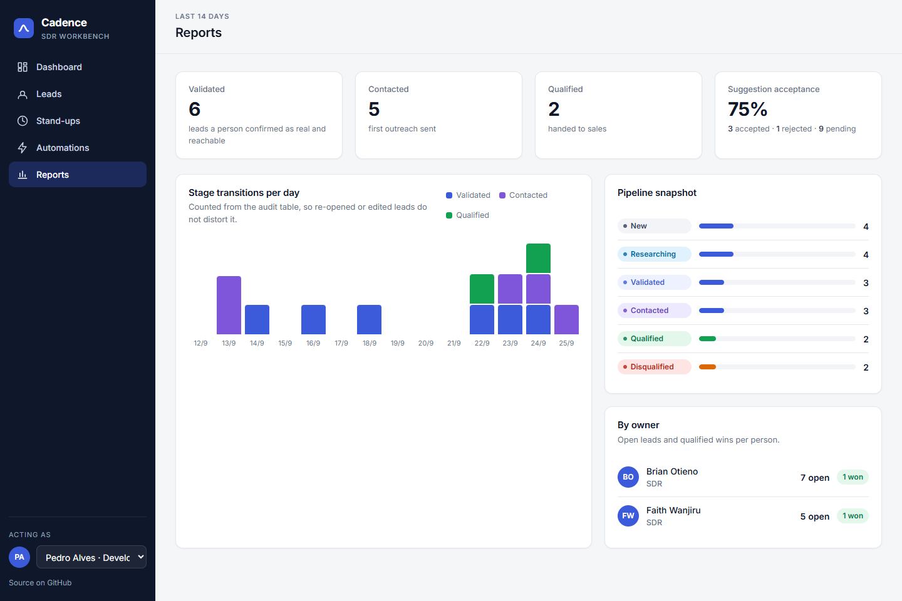

# Cadence

**An SDR workbench: lead pipeline, AI-assisted research with human validation, daily stand-ups and the management report that comes out of them.**

ASP.NET Core MVC · C# 13 / .NET 10 · SQLite locally, Cloudflare D1 in production · Cloudflare Workers + Containers · Docker · xUnit · GitHub Actions


## Why this exists

Sales-development teams lose hours to the same three things: researching leads by hand, re-typing what happened into a CRM, and writing the daily update for management. Cadence is a small internal tool that attacks each one without pretending a model can replace judgement:

- **Pipeline with rules.** Leads move `New → Researching → Validated → Contacted → Qualified` (or `Disqualified`). Every move is an audit event, and the reports are computed from those events, not from mutable rows.
- **AI with human validation.** Rule-based and (optionally) LLM providers *propose* values for empty fields: website from the email domain, industry from the company name, phone normalisation, country from the TLD. A person accepts or rejects each proposal. A lead cannot be validated while anything is still pending.
- **Daily accountability.** Each member answers five questions every morning. The Team Lead gets a plain-text management report generated from those answers plus the day's pipeline numbers: metrics, blockers, decisions needed.
- **Automations.** A signed inbound webhook (HMAC-SHA256 over the raw body) takes leads from website forms and ad platforms, de-duplicates by email, queues enrichment, and logs every delivery, including the rejected ones.

| Leads | Lead detail with suggestions |
| --- | --- |
|  |  |

| Stand-ups and management report | Reports |
| --- | --- |
|  |  |

The UI is a single hand-written stylesheet (no build step) and works on phones: [dashboard](docs/screenshots/mobile-dashboard.png), [lead](docs/screenshots/mobile-lead.png).

## Architecture

```
                 ┌──────────────────────────── Cloudflare ────────────────────────────┐
  browser ──────▶│  Worker (TypeScript)                                               │
  webhooks ─────▶│   ├─ /internal/d1/*  ──▶  D1 binding (SQLite-compatible)           │
                 │   └─ everything else ──▶  Container: ASP.NET Core MVC (this repo)  │
                 │                              └─ ISqlExecutor ──HTTP──▶ Worker /internal/d1/* │
                 └────────────────────────────────────────────────────────────────────┘

  locally:  ASP.NET Core MVC ──▶ ISqlExecutor ──▶ SQLite file (same SQL, same migrations)
```

- **One SQL dialect, two backends.** Repositories depend on `ISqlExecutor` and write plain SQL with positional `?` parameters. `SqliteSqlExecutor` runs it against a local file; `D1WorkerSqlExecutor` posts the same text and parameters to the Worker, which runs them on the D1 binding. D1 is only reachable from a Worker, so this is the honest topology, not an abstraction for its own sake.
- **Migrations are files.** `db/migrations/*.sql` is applied at startup on SQLite and by `wrangler d1 migrations apply` on D1. No ORM, no generated SQL; schemas, indexes and the upsert are written by hand and readable.
- **Batches instead of interactive transactions.** D1 exposes `batch()`, so the executor's atomic operation is a batch of statements; on SQLite it runs inside a transaction. Stage moves (update + audit event) use it.
- **Human in the loop by construction.** `EnrichmentService` only ever inserts *suggestions*. `ReviewAsync` is the single place a value is written to a lead, and it records who decided.
- **Whitelisted columns.** The one dynamic column name in the codebase (`ApplyFieldAsync`) is mapped through a `switch`, never interpolated from input. There is a test for it.

Code map:

```
src/Cadence.Web/
  Data/         ISqlExecutor, SqliteSqlExecutor, D1WorkerSqlExecutor, MigrationRunner, Repositories
  Services/     LeadPipelineService (rules + score), Enrichment (providers + review), StandupReportBuilder, WebhookSignature
  Controllers/  Dashboard, Leads, Standups, Automations (+ /webhooks/leads), Reports
  Views/        Razor views, one layout, one stylesheet
db/migrations/  0001_init.sql (schema + indexes), 0002_seed.sql (demo data)
worker/         Cloudflare Worker: D1 proxy + Container routing, wrangler.jsonc
tests/          xUnit: pipeline rules, enrichment, webhook signature, report builder, HTTP end-to-end
```

## Run it

**With .NET 10**

```bash
cd src/Cadence.Web
dotnet run --urls http://localhost:8080
```

**With Docker**

```bash
docker build -t cadence .
docker run -p 8080:8080 -v cadence-data:/data cadence
```

Open http://localhost:8080. The database is created and seeded on first start. Switch the acting team member in the sidebar; there is no login because the tool is meant to sit behind Cloudflare Access.

**Tests**

```bash
dotnet test
```

**Webhook**

The Automations page prints a ready-to-run `curl` with a valid signature for the configured secret (`Webhooks:Secret`, default `dev-only-change-me`).

**Optional LLM enrichment**

Set `Enrichment__AnthropicApiKey` (and optionally `Enrichment__Model`). The provider asks for strict JSON, validates the fields it gets back, and still only produces suggestions for review. Without the key, the rule-based provider runs alone.

## Deploy to Cloudflare

Requires a Workers Paid plan (Containers) and Wrangler 4.

```bash
cd worker && npm install
npx wrangler login
npx wrangler d1 create cadence                       # paste the id into wrangler.jsonc
npx wrangler d1 migrations apply cadence --remote    # same files as db/migrations
npx wrangler secret put INTERNAL_TOKEN               # shared between Worker and container
npx wrangler secret put WEBHOOK_SECRET
npx wrangler deploy                                  # builds ../Dockerfile and pushes the image
```

The Worker routes public traffic to the container and answers the container's SQL over `/internal/d1/*`. The container is started with `Database__Backend=d1`, so nothing in the app changes between local and production except configuration.

## Continuous integration

`.github/workflows/ci.yml` builds with warnings as errors, runs the test suite, type-checks the Worker and builds the container image on every push and pull request.

## About the AI-assisted parts

The code was written with AI assistance and reviewed line by line; every behaviour that matters has a test. Inside the product, AI is treated the same way: it proposes, a person validates, and the decision is recorded.

Pedro Alves · [pedrow.tech](https://pedrow.tech) · [github.com/pdmoura](https://github.com/pdmoura)
